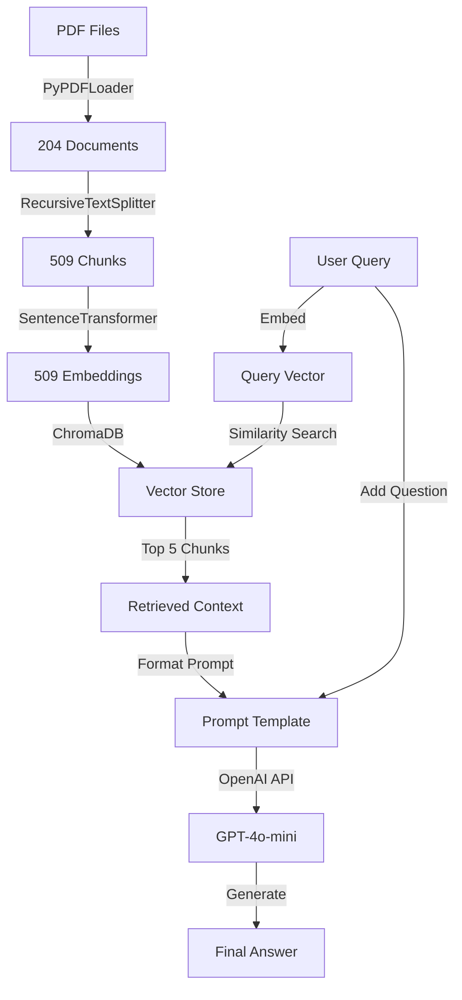

# RAG System Architecture - Detailed Documentation

## 🏗️ System Overview

Your RAG (Retrieval-Augmented Generation) system follows a **3-pipeline architecture**:
1. **Data Ingestion Pipeline** - PDF → Chunks → Embeddings → Vector DB
2. **Retrieval Pipeline** - Query → Embedding → Similarity Search → Context
3. **Generation Pipeline** - Context + Query → LLM → Answer

---

## 📊 Architecture Diagram

```
┌─────────────────────────────────────────────────────────────────────────┐
│                        DATA INGESTION PIPELINE                          │
└─────────────────────────────────────────────────────────────────────────┘

    📄 PDF Files (data/pdf/)
         │
         ├─► PyPDFLoader
         │   └─► Loads 204 pages from SAP HANA PDF
         │
         ▼
    📑 Documents (204 pages)
         │
         ├─► RecursiveCharacterTextSplitter
         │   ├─ chunk_size: 800 characters
         │   ├─ chunk_overlap: 100 characters
         │   └─ separators: ["\n\n", "\n", " ", ""]
         │
         ▼
    🧩 Chunks (509 chunks)
         │
         ├─► EmbeddingManager
         │   ├─ Model: all-MiniLM-L6-v2 (HuggingFace)
         │   ├─ Embedding dimension: 384
         │   └─ Framework: SentenceTransformers
         │
         ▼
    🔢 Embeddings (509 × 384 vectors)
         │
         ├─► VectorStore (ChromaDB)
         │   ├─ Storage: Persistent (./chroma_db)
         │   ├─ Collection: pdf_documents
         │   └─ Metadata: source, page, file_type
         │
         ▼
    💾 Vector Database (ChromaDB)


┌─────────────────────────────────────────────────────────────────────────┐
│                         RETRIEVAL PIPELINE                              │
└─────────────────────────────────────────────────────────────────────────┘

    ❓ User Query
         │
         ├─► EmbeddingManager
         │   └─► Convert query to 384-dim vector
         │
         ▼
    🔢 Query Embedding (1 × 384 vector)
         │
         ├─► RAGRetriever
         │   ├─ Similarity search in ChromaDB
         │   ├─ Top-k retrieval (k=5 default)
         │   └─ Cosine similarity scoring
         │
         ▼
    📚 Retrieved Context (Top 5 relevant chunks)


┌─────────────────────────────────────────────────────────────────────────┐
│                        GENERATION PIPELINE                              │
└─────────────────────────────────────────────────────────────────────────┘

    📚 Retrieved Context + ❓ User Query
         │
         ├─► PromptTemplate
         │   └─► Formats context + question
         │
         ▼
    📝 Formatted Prompt
         │
         ├─► OpenAILLM
         │   ├─ Model: gpt-4o-mini
         │   ├─ API: OpenAI Chat Completions
         │   ├─ Temperature: 0.1 (factual)
         │   └─ Max tokens: 1024
         │
         ▼
    💬 Generated Answer
```

---

## 🔧 Component Details

### 1. **PDF Loader**
```python
Component: PyPDFLoader (LangChain)
Input: PDF files from ../data/pdf/
Output: 204 Document objects
Metadata: source, page, total_pages, creator, etc.
```

### 2. **Text Splitter**
```python
Component: RecursiveCharacterTextSplitter
Strategy: Hierarchical splitting
Parameters:
  - chunk_size: 800 chars
  - chunk_overlap: 100 chars
  - separators: ["\n\n", "\n", " ", ""]
Input: 204 documents
Output: 509 chunks
```

### 3. **Embedding Manager**
```python
Component: SentenceTransformer
Model: all-MiniLM-L6-v2
Source: HuggingFace
Embedding Dimension: 384
Performance: Fast, lightweight
Use Case: Semantic similarity search
```

### 4. **Vector Store**
```python
Component: ChromaDB
Type: Persistent vector database
Storage Path: ./chroma_db
Collection: pdf_documents
Index Type: HNSW (approximate nearest neighbor)
Distance Metric: Cosine similarity
Total Vectors: 509 embeddings
```

### 5. **RAG Retriever**
```python
Component: Custom RAGRetriever class
Method: Similarity search
Top-k: 5 (configurable)
Scoring: Cosine distance → similarity score
Output: Ranked relevant chunks
```

### 6. **LLM Generator**
```python
Component: OpenAI GPT-4o-mini
API: OpenAI Chat Completions
Temperature: 0.1 (low = factual)
Max Tokens: 1024
Prompt Strategy: Context-grounded generation
```

---

## 📈 Data Flow Statistics

| Stage | Input | Output | Transformation |
|-------|-------|--------|----------------|
| **PDF Loading** | 1 PDF file | 204 documents | Page extraction |
| **Chunking** | 204 documents | 509 chunks | Text splitting |
| **Embedding** | 509 chunks | 509 × 384 vectors | Semantic encoding |
| **Storage** | 509 vectors | ChromaDB index | Vector indexing |
| **Retrieval** | 1 query | 5 chunks | Similarity search |
| **Generation** | Context + query | 1 answer | LLM synthesis |

---

## 🔐 Configuration Files

### Environment Variables (.env)
```bash
OPENAI_API_KEY=sk-proj-...
```

### Dependencies (requirement.txt)
```
langchain
langchain-core
langchain-community
langchain_openai
pypdf
pymupdf
jupyter
sentence-transformers
faiss-cpu
chromadb
python-dotenv
```

---

## 🚀 Execution Flow

### Phase 1: Indexing (One-time setup)
```
1. Load PDFs → 204 pages
2. Split into chunks → 509 chunks
3. Generate embeddings → 509 × 384 vectors
4. Store in ChromaDB → Persistent storage
```

### Phase 2: Query (Runtime)
```
1. User asks question
2. Convert query to embedding → 1 × 384 vector
3. Search ChromaDB → Top 5 similar chunks
4. Format prompt with context
5. Send to GPT-4o-mini
6. Return generated answer
```

---

## 💾 Storage Structure

```
/Users/prajwal/Desktop/RAG/
├── data/
│   └── pdf/
│       └── HA201 - SAP HANA 2.0 SPS05.pdf
├── notebook/
│   └── pdf_loader.ipynb (Main RAG pipeline)
├── chroma_db/ (Vector database - persistent)
│   └── [ChromaDB files]
├── .env (API keys)
├── requirement.txt
└── .venv/ (Virtual environment)
```

---

## ⚡ Performance Characteristics

### Embedding Model (all-MiniLM-L6-v2)
- **Speed**: ~1000 sentences/sec on CPU
- **Size**: 80 MB
- **Quality**: Good for semantic search
- **Dimension**: 384 (compact)

### Vector Database (ChromaDB)
- **Query Speed**: <100ms for 509 vectors
- **Scalability**: Millions of vectors
- **Storage**: Persistent on disk
- **Index**: HNSW (fast approximate search)

### LLM (GPT-4o-mini)
- **Speed**: ~2-5 seconds per response
- **Cost**: $0.15/1M input tokens
- **Context Window**: 128K tokens
- **Quality**: High accuracy, factual

---

## 🎯 RAG Strategy

### Retrieval Strategy
- **Method**: Dense vector similarity (cosine)
- **Top-k**: 5 chunks
- **Reranking**: None (can be added)
- **Filtering**: Metadata-based (optional)

### Generation Strategy
- **Temperature**: 0.1 (factual, deterministic)
- **System Prompt**: "Use ONLY the context below"
- **Max Tokens**: 1024
- **Grounding**: Strict context adherence

---

## 🔄 Workflow Summary



---

## 📝 Key Features

✅ **Persistent Storage**: ChromaDB saves embeddings to disk  
✅ **Semantic Search**: Dense embeddings capture meaning  
✅ **Overlap Strategy**: 100-char overlap prevents context loss  
✅ **Metadata Tracking**: Source, page numbers preserved  
✅ **Factual Generation**: Low temperature + context grounding  
✅ **Scalable**: Can handle thousands of documents  
✅ **Cost-Effective**: Local embeddings + cheap LLM  

---

## 🛠️ Future Enhancements

1. **Hybrid Search**: Combine dense + sparse (BM25) retrieval
2. **Reranking**: Add cross-encoder for better relevance
3. **Streaming**: Stream LLM responses in real-time
4. **Caching**: Cache frequent queries
5. **Multi-query**: Generate multiple query variations
6. **Evaluation**: Add RAGAS metrics for quality assessment
